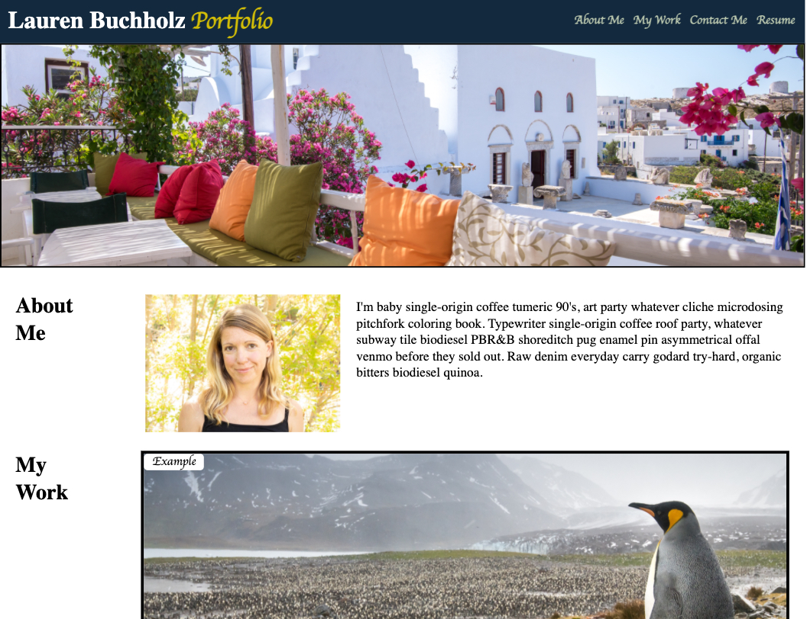

# Portfolio

## Bootcamp homework #2 and portfolio page foundation

An employer/hiring manager has requested a portfolio page highlighting my experience using HTML and CSS. The following portfolio requisites ("Acceptance criteria") were requested and have now been implemented:

- "About Me", "My Work" and "Contact" sections were created, including a portrait in the "About Me" section.
- All links housed in the navigation bar auto-scroll to their respective sections or indicate if the section has not yet been constructed ("Coming Soon").
- The "My Work" section includes titled images and empty links as placeholders for future application samples.
- Under "My Work", the first application on the list is larger than the others.
- The page has a responsive layout for smaller screens.

Additionally, all images have alt tags attributed to them for accessibility and the CSS includes comments.

## Portfolio webpage

The following is a screenshot of the webpage, highlighting its appearance and functionality:

## Link to deployed application

My initial portfolio page can now be found here: LINK ONCE YOU'VE DEPLOYED APPLICATION
