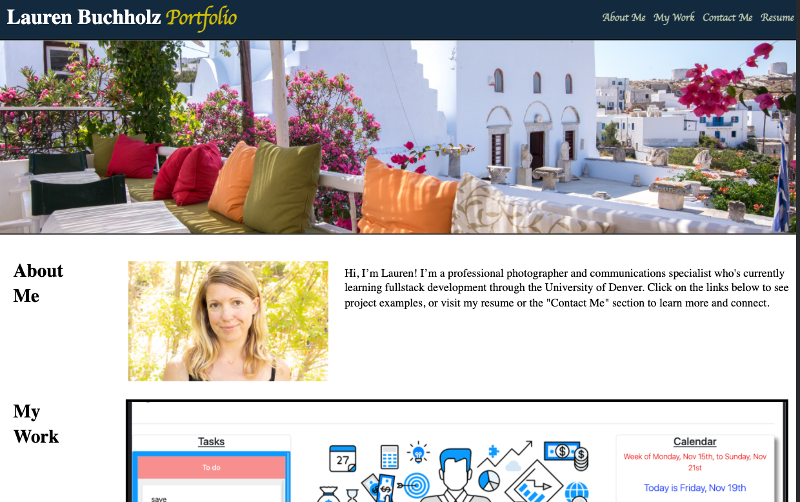

# Portfolio

## Portfolio page

An employer/hiring manager has requested a portfolio page highlighting my experience using HTML and CSS. The following portfolio requisites ("Acceptance criteria") were requested and have now been implemented:

- "About Me", "My Work" and "Contact" sections were created, including a portrait in the "About Me" section.
- All links housed in the navigation bar auto-scroll to their respective sections or indicate if the section has not yet been constructed ("Coming Soon").
- The "My Work" section includes titled images and empty links as placeholders for future application samples.
- Under "My Work", the first application on the list is larger than the others.
- The page has a responsive layout for smaller screens.

## UPDATE -- 11/20/2021

- My first project -- a collaborative group effort on the demo uProjekt project management program -- has been added to the "My Work" section with a deployed URL.
- Two other coding assignments have been added to "My Work".
- A resume has been updated and posted online.
- GitHub and LinkedIn have been updated.

Additionally, all images have alt tags attributed to them for accessibility and the CSS includes comments.

## Portfolio webpage

The following is a screenshot of the webpage, highlighting its appearance and functionality:

## Link to deployed application

My portfolio page can be found here: https://l-buchholz.github.io/portfolio/
